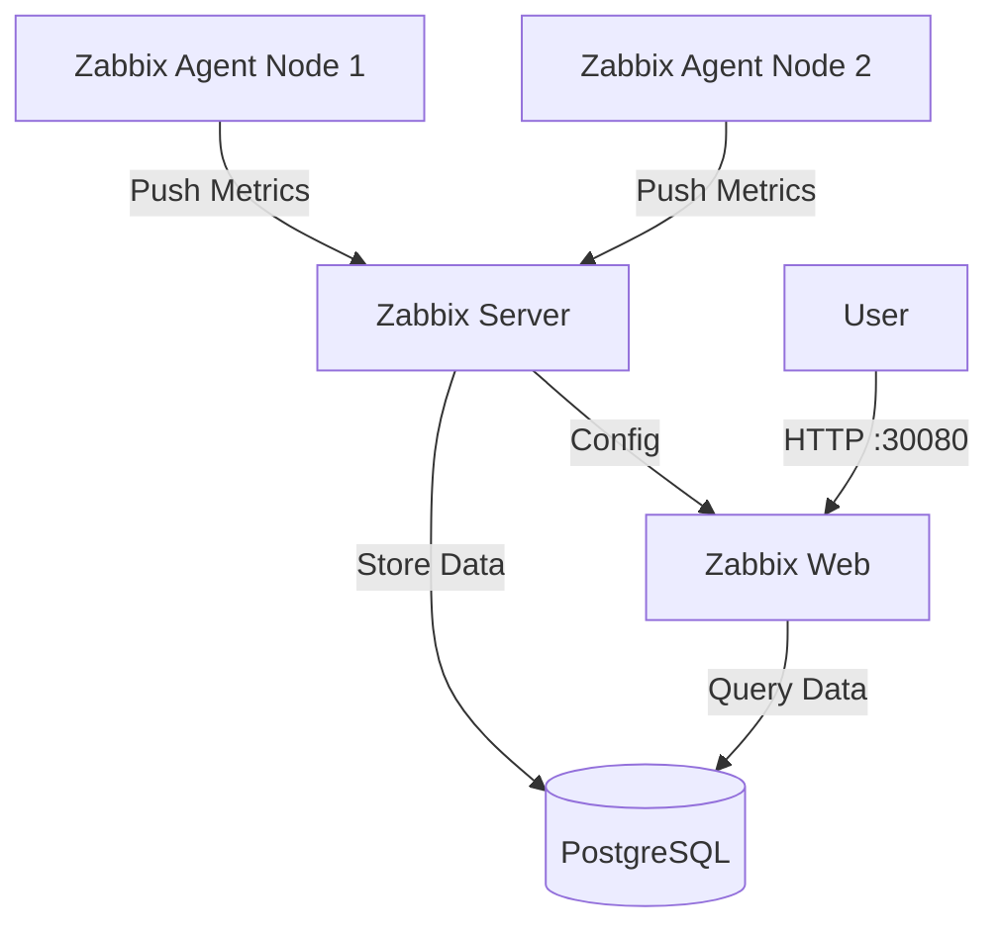

# 🎬 Vídeo 1.1 - Introdução ao Monitoramento e Criação do Cluster EKS

**Aula**: 1 - Zabbix no Kubernetes  
**Vídeo**: 1.1  
**Temas**: Importância do monitoramento; Demo local; Criação cluster EKS; Início deploy  
**Tempo estimado**: 20 minutos

---

## 📚 Parte 1: Conceito e Arquitetura (5 min)

### Passo 1: Importância do Monitoramento

**Por que monitorar?**
- Detectar problemas antes dos usuários
- Entender comportamento do sistema
- Planejar capacidade
- Troubleshooting rápido

**Tipos de monitoramento:**
- **Infraestrutura**: CPU, memória, disco, rede
- **Aplicações**: Requisições, latência, erros
- **Negócio**: Transações, vendas, usuários ativos

---

### Passo 2: Arquitetura Zabbix

**Componentes principais:**
- **Zabbix Server**: Coleta e processa dados
- **Zabbix Web**: Interface web (PHP)
- **Zabbix Agent**: Coleta métricas do host
- **PostgreSQL**: Banco de dados



**Fluxo de dados:**
1. Agent coleta métricas do sistema
2. Envia para Zabbix Server (push)
3. Server armazena no PostgreSQL
4. Web interface consulta dados

---

## Parte 2: Demo Local Rápida (3 min)

### Passo 3: Subir Zabbix Local

```bash
cd ~/monitoramentoEacesso/Aula-1

# Subir stack completa
docker-compose up -d

# Aguardar 2 minutos
sleep 120

# Verificar status
docker-compose ps
```

### Passo 4: Acessar Interface

```bash
# Abrir Zabbix
open http://localhost:8080
# Login: Admin / zabbix
```

**Mostrar rapidamente:**
- Dashboard
- Monitoring → Latest data
- Configuration → Hosts

### Passo 5: Parar Demo Local

```bash
# Parar e limpar
docker-compose down -v
```

---

## ☸️ Parte 3: Criar Cluster EKS (Comandos - Não conta no tempo)

### Passo 6: Verificar Pré-requisitos AWS

```bash
# Verificar AWS CLI
aws --version

# Verificar credenciais
aws sts get-caller-identity --profile fiapaws

# Verificar kubectl
kubectl version --client
```

### Passo 7: Criar Cluster EKS

```bash
# Criar cluster EKS (AWS Learner Lab compatible)
# Filtrar subnets apenas das zonas suportadas pelo EKS (excluir us-east-1e)
aws eks create-cluster \
  --name monitoring-lab \
  --region us-east-1 \
  --role-arn arn:aws:iam::$(aws sts get-caller-identity --profile fiapaws --query Account --output text):role/LabRole \
  --resources-vpc-config subnetIds=$(aws ec2 describe-subnets --profile fiapaws --region us-east-1 --query 'Subnets[?MapPublicIpOnLaunch==`true` && (AvailabilityZone==`us-east-1a` || AvailabilityZone==`us-east-1b` || AvailabilityZone==`us-east-1c` || AvailabilityZone==`us-east-1d` || AvailabilityZone==`us-east-1f`)].SubnetId' --output text | tr '\t' ',') \
  --profile fiapaws

# Aguardar cluster ativo (15-20 min)
aws eks wait cluster-active \
  --name monitoring-lab \
  --region us-east-1 \
  --profile fiapaws
```

### Passo 8: Criar Node Group

```bash
# Criar node group
aws eks create-nodegroup \
  --cluster-name monitoring-lab \
  --nodegroup-name workers \
  --node-role arn:aws:iam::$(aws sts get-caller-identity --profile fiapaws --query Account --output text):role/LabRole \
  --subnets $(aws ec2 describe-subnets --profile fiapaws --region us-east-1 --query 'Subnets[?MapPublicIpOnLaunch==`true` && (AvailabilityZone==`us-east-1a` || AvailabilityZone==`us-east-1b` || AvailabilityZone==`us-east-1c` || AvailabilityZone==`us-east-1d` || AvailabilityZone==`us-east-1f`)].SubnetId' --output text | tr '\t' ' ') \
  --instance-types t3.medium \
  --scaling-config minSize=2,maxSize=2,desiredSize=2 \
  --region us-east-1 \
  --profile fiapaws

# Aguardar node group ativo
aws eks wait nodegroup-active \
  --cluster-name monitoring-lab \
  --nodegroup-name workers \
  --region us-east-1 \
  --profile fiapaws
```

### Passo 9: Configurar kubectl

```bash
# Configurar acesso ao cluster
aws eks update-kubeconfig \
  --name monitoring-lab \
  --region us-east-1 \
  --profile fiapaws

# Verificar nodes
kubectl get nodes

# Criar namespace
kubectl create namespace monitoring
```

### Passo 9: Explicação sobre Storage (Didático)

```bash
# CONCEITO IMPORTANTE: Storage em Kubernetes

# EM PRODUÇÃO: Usaríamos PVCs com EBS CSI Driver
# kubectl apply -f postgres-pvc.yaml -n monitoring
# Dados persistentes, sobrevivem a reinicializações

# AWS LEARNER LAB: EBS CSI Driver falha por limitações de permissões
# Solução: emptyDir (temporário, mas funcional para demonstrações)
# Os deployments estão configurados com ambas as opções comentadas

echo "Para este curso: usando emptyDir (dados temporários)"
echo "Em produção: usar PVCs (dados persistentes)"
```

---

## 🎯 Parte 4: Preparação para Deploy (5 min)

### Passo 10: Revisar Manifestos

```bash
cd ~/monitoramentoEacesso/Aula-1/kubernetes

# Listar arquivos disponíveis
ls -la *.yaml

# MOSTRAR: Diferença entre produção e Learner Lab
cat postgres-pvc.yaml
echo "^ Produção: PVC persistente"

cat postgres-deployment.yaml | grep -A 6 "volumes:"
echo "^ Learner Lab: emptyDir temporário (adequado para curso)"
```

### Passo 11: Conceitos Importantes

**Storage em Kubernetes:**
- **PVC + StorageClass**: Produção (dados persistentes)
- **emptyDir**: Laboratório (dados temporários)
- **hostPath**: Desenvolvimento local

**Services:**
- **ClusterIP**: Interno ao cluster
- **NodePort**: Acesso externo (30000-32767)
- **LoadBalancer**: Cloud providers

**Próxima aula:** Deploy completo no EKS!

---

**Duração**: ~20 minutos  
**Próximo**: VIDEO-1.2-PASSO-A-PASSO.md
