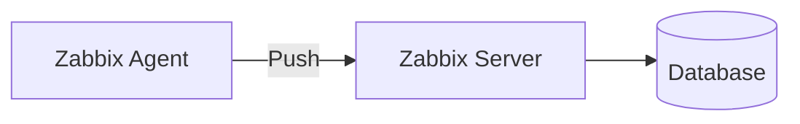
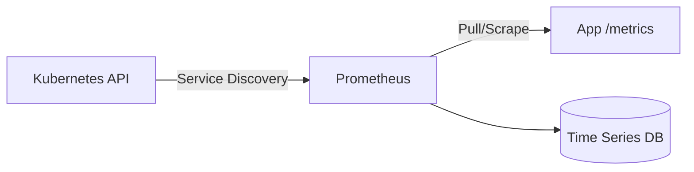

# 🎬 Vídeo 2.1 - Prometheus e ECR

**Aula**: 2 - Prometheus + .NET no Kubernetes  
**Vídeo**: 2.1  
**Temas**: Prometheus; Pull vs Push; ECR; Deploy no K8s  
**Tempo estimado**: 20 minutos

---

## 📚 Parte 1: Conceito Prometheus (5 min)

### Passo 1: Apresentação do Prometheus

**O que é:**
- Sistema de monitoramento open-source
- Modelo Pull (busca métricas)
- Time series database
- PromQL (linguagem de queries)

**Push vs Pull:**
- **Zabbix (Push)**: Agent → envia → Server
- **Prometheus (Pull)**: Server ← busca ← Target

**Push Model (Zabbix):**


**Pull Model (Prometheus):**


**Vantagens Pull:**
- Targets não precisam saber onde está o Prometheus
- Service discovery automático
- Melhor para ambientes dinâmicos (K8s)

---

## 🔄 Parte 2: Continuação da Aula 1 + Demo (5 min)

### Passo 2: Verificar Ambiente da Aula 1

```bash
# Verificar se cluster e Zabbix existem
kubectl get nodes 2>/dev/null
kubectl get pods -n monitoring 2>/dev/null

# Se Zabbix não estiver rodando, deploy rápido:
cd ~/monitoramentoEacesso/Aula-1/kubernetes
kubectl apply -f postgres-secret.yaml -n monitoring
kubectl apply -f postgres-deployment.yaml -n monitoring
kubectl apply -f zabbix-server-deployment.yaml -n monitoring
kubectl apply -f zabbix-web-deployment.yaml -n monitoring
kubectl apply -f zabbix-agent-daemonset.yaml -n monitoring

# Aguardar stack Zabbix ready
kubectl wait --for=condition=ready pod -l app=zabbix-server -n monitoring --timeout=300s
```

**Se cluster NÃO existir, recriar conforme Aula 1**

### Passo 3: Demo Local Rápida

```bash
cd ~/monitoramentoEacesso/Aula-2

# Subir Prometheus + Weather API
docker-compose up -d

# Acessar
open http://localhost:9090  # Prometheus
open http://localhost:5001/swagger  # Weather API

# Parar
docker-compose down -v
```

---

## ☸️ Parte 3: ECR e Deploy (10 min)

### Passo 4: Criar Repositório ECR

```bash
# Obter Account ID
export AWS_ACCOUNT_ID=$(aws sts get-caller-identity \
  --profile fiapaws \
  --query Account \
  --output text)

echo "Account ID: $AWS_ACCOUNT_ID"

# Criar repositório
aws ecr create-repository \
  --repository-name weather-api \
  --region us-east-1 \
  --profile fiapaws

### Passo 5: Build e Push

```bash
cd ~/monitoramentoEacesso/Aula-2/dotnet-app

# Login ECR
aws ecr get-login-password --region us-east-1 --profile fiapaws | \
  docker login --username AWS --password-stdin ${AWS_ACCOUNT_ID}.dkr.ecr.us-east-1.amazonaws.com

# Build para arquitetura AMD64 (compatível com EC2)
# Já tageia diretamente com o URI do ECR
docker build --platform linux/amd64 -t ${AWS_ACCOUNT_ID}.dkr.ecr.us-east-1.amazonaws.com/weather-api:latest .

# Push para ECR
docker push ${AWS_ACCOUNT_ID}.dkr.ecr.us-east-1.amazonaws.com/weather-api:latest
```

### Passo 6: Deploy Prometheus

```bash
cd ~/monitoramentoEacesso/Aula-2/kubernetes

# MOSTRAR: Diferença entre produção e Learner Lab
# cat prometheus-pvc.yaml
# echo "^ Produção: PVC persistente"
# cat prometheus-deployment.yaml | grep -A 6 "prometheus-storage"
# echo "^ Learner Lab: emptyDir temporário"

# Deploy Prometheus (usando emptyDir - sem PVC)
kubectl apply -f prometheus-configmap.yaml -n monitoring
kubectl apply -f prometheus-deployment.yaml -n monitoring

# Aguardar
kubectl wait --for=condition=ready pod -l app=prometheus -n monitoring --timeout=300s
```

### Passo 7: Deploy Weather API

```bash
# Atualizar imagem no manifesto
sed -i.bak "s|image: weather-api:latest|image: ${AWS_ACCOUNT_ID}.dkr.ecr.us-east-1.amazonaws.com/weather-api:latest|g" weather-api-deployment.yaml

# Editar para NodePort
nano weather-api-deployment.yaml
# Alterar type: NodePort e nodePort: 30081

# Deploy
kubectl apply -f weather-api-deployment.yaml -n monitoring
kubectl wait --for=condition=ready pod -l app=weather-api -n monitoring --timeout=300s
```

### Passo 8: Verificar Coleta

```bash
# Port forward Prometheus
kubectl port-forward svc/prometheus 9090:9090 -n monitoring &
open http://localhost:9090

# Status → Targets
# Verificar: prometheus (UP), weather-api (UP)
```

---

**Duração**: ~20 minutos  
**Próximo**: VIDEO-2.2-PASSO-A-PASSO.md
