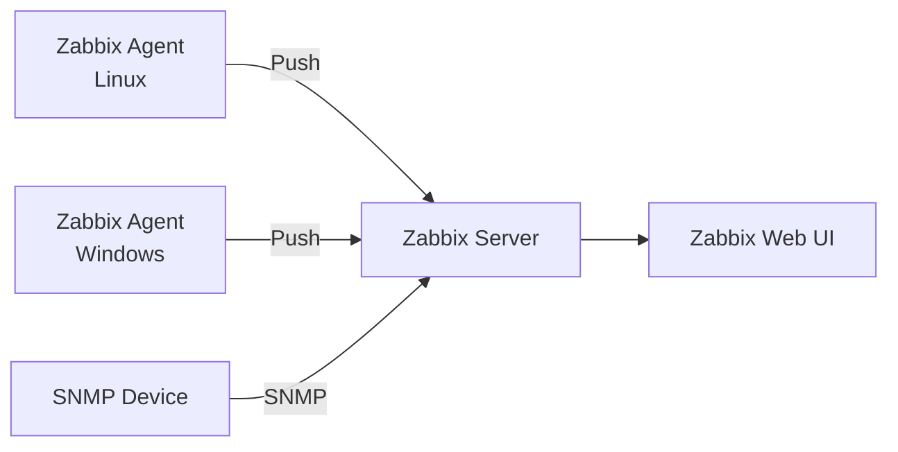
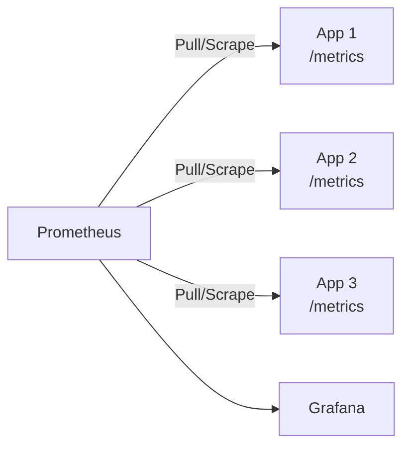
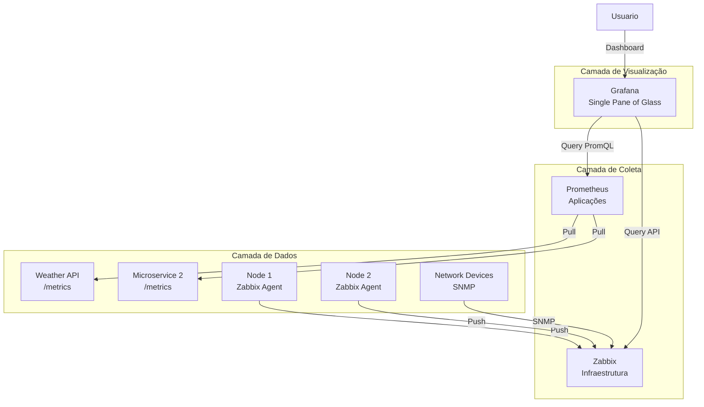

# 🎬 Vídeo 2.3 - Zabbix vs Prometheus

**Aula**: 2 - Prometheus + .NET no Kubernetes  
**Vídeo**: 2.3  
**Temas**: Comparativo; Cenários; Sinergia; Limpeza  

---

## Parte 1: Comparativo

### Passo 1: Comparar Modelos

**Zabbix - Push Model (Infraestrutura)**


**Prometheus - Pull Model (Aplicações)**


**Tabela Comparativa:**

| Aspecto | Zabbix | Prometheus |
|---------|--------|------------|
| **Modelo** | Push (Agent envia) | Pull (Server busca) |
| **Foco** | Infraestrutura | Aplicações |
| **UI** | Built-in | Externa (Grafana) |
| **Configuração** | Interface Web + Templates | YAML + Service Discovery |
| **Alertas** | Triggers | AlertManager |
| **Histórico** | Longo prazo (anos) | Curto prazo (dias) |
| **Query** | Interface Web | PromQL |

### Passo 2: Quando Usar Zabbix

**Cenários ideais:**
- Monitoramento de infraestrutura
- Servidores físicos e VMs
- Equipamentos de rede (SNMP)
- Ambiente corporativo tradicional
- Equipe de operações tradicional

### Passo 3: Quando Usar Prometheus

**Cenários ideais:**
- Monitoramento de aplicações
- Microserviços
- Containers e Kubernetes
- Métricas de negócio
- DevOps/SRE culture

### Passo 4: Sinergia - Usar Ambos

**Arquitetura Completa de Observabilidade:**



**Benefícios da Arquitetura Híbrida:**
- ✅ **Observabilidade completa**: Aplicações + Infraestrutura
- ✅ **Melhor ferramenta para cada caso**: Prometheus (apps) + Zabbix (infra)
- ✅ **Visualização unificada**: Grafana como ponto único
- ✅ **Flexibilidade**: Adicionar novas fontes de dados facilmente

---

## 📊 Parte 2: Demonstração

### Passo 5: Ver Ambos Funcionando

```bash
# Port forward Prometheus
kubectl port-forward svc/prometheus 9090:9090 -n monitoring &

# Se Zabbix estiver rodando (da Aula 1):
kubectl port-forward svc/zabbix-web 8080:80 -n monitoring &

# Abrir ambos
open http://localhost:9090  # Prometheus
open http://localhost:8080  # Zabbix (se disponível)
```

**No Prometheus:**
- Query: `weather_requests_total`
- Ver métricas de aplicação

**No Zabbix (se disponível):**
- Latest data
- Ver métricas de infraestrutura

### Passo 6: Comparar Métricas

**Zabbix coleta:**
- system.cpu.util
- vm.memory.size
- vfs.fs.size

**Prometheus coleta:**
- weather_requests_total
- weather_request_duration_seconds
- http_requests_received_total

**São complementares!**

---

## 🧹 Parte 3: Limpeza

### Passo 7: Deletar Recursos da Aula 2

```bash
# Deletar Weather API e Prometheus
kubectl delete deployment weather-api prometheus -n monitoring
kubectl delete service weather-api prometheus -n monitoring
kubectl delete configmap prometheus-config -n monitoring
kubectl delete pvc prometheus-data -n monitoring
```

### Passo 8: Deletar ECR

```bash
# Deletar repositório ECR
aws ecr delete-repository \
  --repository-name weather-api \
  --force \
  --region us-east-1 \
  --profile fiapaws
```

### Passo 9: Manter ou Deletar Cluster

**Opção 1: Manter para Aula 3**
```bash
# Apenas deletar recursos da Aula 2
echo "Cluster mantido para Aula 3"
```

**Opção 2: Deletar tudo**
```bash
# Deletar namespace
kubectl delete namespace monitoring

# Deletar cluster
aws eks delete-nodegroup \
  --cluster-name monitoring-lab \
  --nodegroup-name workers \
  --region us-east-1 \
  --profile fiapaws

aws eks delete-cluster \
  --name monitoring-lab \
  --region us-east-1 \
  --profile fiapaws
```

---

**FIM DA AULA 2**
