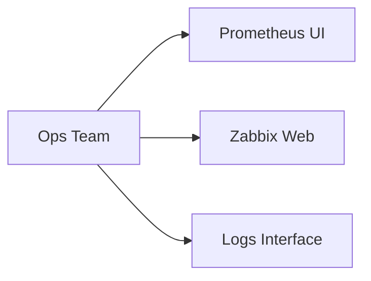
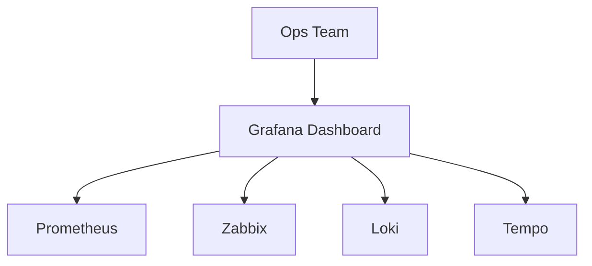

# 🎬 Vídeo 3.1 - Grafana e Datasources

**Aula**: 3 - Grafana no Kubernetes  
**Vídeo**: 3.1  
**Temas**: Grafana; Single pane; Deploy; Datasources  

---

## 📚 Parte 1: Conceito Grafana

### Passo 1: Apresentação do Grafana

**O que é:**
- Plataforma de visualização
- Multi-datasource
- Dashboards interativos
- Padrão de mercado

### Passo 2: Single Pane of Glass

**Problema sem Grafana:**
```
Prometheus → Interface própria
Zabbix → Interface própria
Logs → Interface própria
```

**Sem Grafana - Múltiplas Interfaces:**


**Com Grafana - Single Pane of Glass:**


**Solução com Grafana:**
```
GRAFANA (Single Pane)
    ↓
Prometheus + Zabbix + Loki + Tempo
```

---

## 🐳 Parte 2: Demo Local

### Passo 3: Verificar Cluster

```bash
# Verificar se cluster existe
kubectl get nodes 2>/dev/null

# Se não existir, recriar:
# 1. Criar cluster e node group (comandos da Aula 1/2)
# 2. Configurar kubectl e namespace
# Nota: Usando emptyDir volumes (compatível com AWS Learner Lab)
```

### Passo 4: Demo Local Rápida

```bash
cd ~/monitoramentoEacesso/Aula-3

# Subir Grafana + Prometheus + Weather API
docker-compose up -d

# Acessar Grafana
open http://localhost:3000
# Login: admin / admin

# Parar
docker-compose down -v
```

---

## ☸️ Parte 3: Deploy Grafana

### Passo 5: Deploy Grafana

```bash
cd ~/monitoramentoEacesso/Aula-3/kubernetes

# ConfigMap (datasources)
kubectl apply -f grafana-configmap.yaml -n monitoring

# MOSTRAR: Conceito de storage persistente vs temporário
# cat grafana-pvc.yaml
# echo "^ Produção: dados persistem entre reinicializações"
# cat grafana-deployment.yaml | grep -A 6 "grafana-storage"
# echo "^ Learner Lab: dados temporários (adequado para curso)"

# Editar para NodePort
nano grafana-deployment.yaml
# Alterar type: NodePort, nodePort: 30300

# Deploy (usando emptyDir - sem PVC)
kubectl apply -f grafana-deployment.yaml -n monitoring
kubectl wait --for=condition=ready pod -l app=grafana -n monitoring --timeout=300s
```

---

## 🔌 Parte 4: Configurar Datasources

### Passo 6: Acessar Grafana

```bash
# Port forward
kubectl port-forward svc/grafana 3000:80 -n monitoring &
open http://localhost:3000

# Login: admin / admin
```

### Passo 7: Deploy Weather API

```bash
# Deploy Weather API (se não estiver rodando)
cd ~/monitoramentoEacesso/Aula-2/kubernetes
kubectl apply -f weather-api-deployment.yaml -n monitoring

# Aguardar ready
kubectl wait --for=condition=ready pod -l app=weather-api -n monitoring --timeout=300s

# Verificar todos os serviços
kubectl get pods -n monitoring
```

### Passo 8: Verificar Acesso ao Grafana

```bash
# Obter IP do node
kubectl get nodes -o wide

# Acessar Grafana: http://<NODE_IP>:30300
# Login: admin / admin
```

---

**Próximo**: VIDEO-3.2-PASSO-A-PASSO.md
