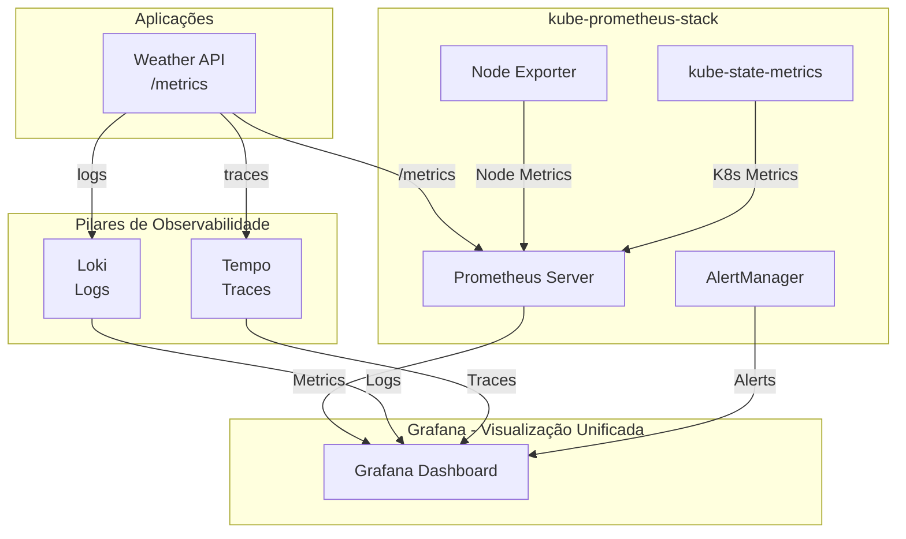

# Vídeo 3.3 - Stack Completa de Observabilidade

**Aula**: 3 - Grafana no Kubernetes  
**Vídeo**: 3.3  
**Temas**: kube-prometheus-stack; Loki; Tempo; Observabilidade completa  

**Stack Completa de Observabilidade:**



**3 Pilares da Observabilidade:**
- **Metrics** (Prometheus): O que está acontecendo?
- **Logs** (Loki): Por que está acontecendo?
- **Traces** (Tempo): Onde está acontecendo?

**Organização de Namespaces:**
- `monitoring`: Zabbix + Prometheus (Aulas 1 e 2)
- `observability`: kube-prometheus-stack + Loki + Tempo (Aula 3)

---

## ⚡ Parte 1: kube-prometheus-stack

### Passo 1: Instalar Helm

```bash
# Verificar Helm
helm version

# Se não estiver instalado:
# macOS: brew install helm
# Linux: curl https://raw.githubusercontent.com/helm/helm/main/scripts/get-helm-3 | bash
```

### Passo 2: Adicionar Repositórios

```bash
# Adicionar repos
helm repo add prometheus-community https://prometheus-community.github.io/helm-charts
helm repo add grafana https://grafana.github.io/helm-charts
helm repo update
```

### Passo 3: Criar Namespace Observability

```bash
# Criar namespace separada para stack de observabilidade
kubectl create namespace observability

# Verificar namespaces
kubectl get namespaces
```

### Passo 4: Deploy Stack Completa

```bash
# Deploy kube-prometheus-stack na namespace observability
helm install kube-prometheus-stack prometheus-community/kube-prometheus-stack \
  --namespace observability \
  --set prometheus.service.type=NodePort \
  --set prometheus.service.nodePort=30090 \
  --set grafana.service.type=NodePort \
  --set grafana.service.nodePort=30300

# Aguardar pods (2-3 min)
kubectl wait --for=condition=ready pod -l "release=kube-prometheus-stack" -n observability --timeout=300s
```

**O que foi instalado:**
- Prometheus + AlertManager
- Grafana com dashboards prontos
- Node Exporter + kube-state-metrics

### Passo 4: Acessar Grafana

```bash
# Obter senha
kubectl get secret kube-prometheus-stack-grafana -n observability -o jsonpath="{.data.admin-password}" | base64 --decode
echo

# Acessar
kubectl port-forward svc/kube-prometheus-stack-grafana 3000:80 -n observability &
open http://localhost:3000
# Login: admin / <senha_obtida>
```

### Passo 5: Explorar Dashboards Prontos

**No Grafana:**
1. **Dashboards → Browse**
2. Ver dashboards:
   - Kubernetes / Compute Resources / Cluster
   - Node Exporter / Nodes
   - Prometheus / Overview

**Dashboards profissionais prontos!**

---

## 📝 Parte 2: Adicionar Loki

### Passo 6: Deploy Loki

```bash
# Deploy Loki
helm install loki grafana/loki-stack \
  --namespace observability \
  --set grafana.enabled=false \
  --set prometheus.enabled=false \
  --set promtail.enabled=true

# Aguardar
kubectl wait --for=condition=ready pod -l "app=loki" -n observability --timeout=180s
```

### Passo 7: Adicionar Datasource Loki

**No Grafana:**
1. **Connections → Data sources → Add data source**
2. **Loki**
3. URL: `http://loki:3100`
   - **Nota**: Como Grafana e Loki estão na mesma namespace, pode usar nome curto
   - Alternativa: `http://loki.observability.svc.cluster.local:3100`
4. **Save & test**

**Se der erro de conexão:**
```bash
# Verificar se Loki está rodando
kubectl get pods -n observability | grep loki

# Testar conectividade do Grafana
kubectl exec -n observability $(kubectl get pod -n observability -l app.kubernetes.io/name=grafana -o name) -- wget -O- http://loki:3100/ready
```

### Passo 8: Testar Logs

**No Grafana:**
1. **Explore**
2. Datasource: **Loki**
3. Query: `{namespace="observability"}`
4. **Run query**

**Ver logs dos pods!**

---

## 🔍 Parte 3: Adicionar Tempo

### Passo 9: Deploy Tempo

```bash
# Deploy Tempo
helm install tempo grafana/tempo \
  --namespace observability

# Aguardar
kubectl wait --for=condition=ready pod -l "app.kubernetes.io/name=tempo" -n observability --timeout=180s
```

### Passo 10: Adicionar Datasource Tempo

**No Grafana:**
1. **Connections → Data sources → Add data source**
2. **Tempo**
3. URL: `http://tempo:3100`
   - **Nota**: Como Grafana e Tempo estão na mesma namespace, pode usar nome curto
   - Alternativa: `http://tempo.observability.svc.cluster.local:3100`
4. **Save & test**

---

## 🎯 Parte 4: Stack Completa

### Passo 11: Verificar 3 Pilares

**No Grafana:**
1. **Connections → Data sources**
2. Ver datasources:
   - ✅ **Prometheus** (métricas)
   - ✅ **Loki** (logs)
   - ✅ **Tempo** (traces)

**Observabilidade completa!**

### Passo 12: Demonstrar Correlação

**1. Métricas (Prometheus):**
- Dashboard: Kubernetes / Compute Resources / Cluster
- Ver CPU/memória

**2. Logs (Loki):**
- Explore → Loki
- Query: `{namespace="monitoring"} |= "error"`

**3. Traces (Tempo):**
- Explore → Tempo
- Buscar trace ID

### Passo 13: Limpeza Final

```bash
# Deletar releases Helm
helm uninstall kube-prometheus-stack -n observability
helm uninstall loki -n observability
helm uninstall tempo -n observability

# Deletar namespace observability
kubectl delete namespace observability

# Deletar cluster
aws eks delete-nodegroup \
  --cluster-name monitoring-lab \
  --nodegroup-name workers \
  --region us-east-1 \
  --profile fiapaws

aws eks delete-cluster \
  --name monitoring-lab \
  --region us-east-1 \
  --profile fiapaws
```

---

**FIM DA AULA 3** 🎓
